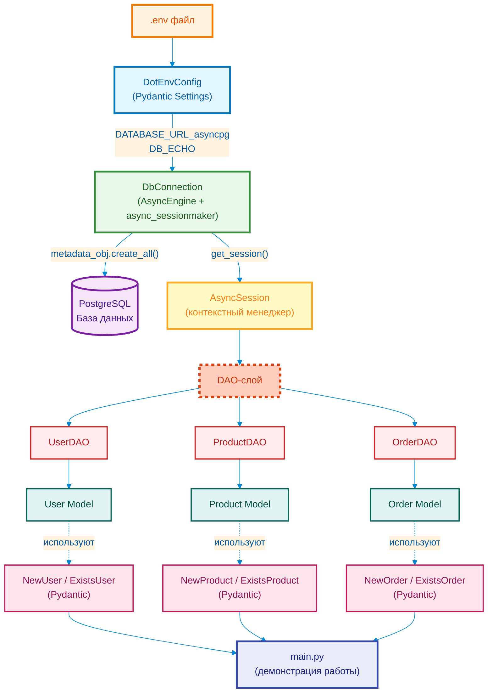

# SQLAlchemyExample

Небольшой изолированный пример, показывающий, как в этом проекте
выглядит связка:

`.env` → `env_config` → `DbConnection` → модели SQLAlchemy → DAO → Pydantic-схемы.

## Структура

```
SQLAlchemyExample/
├── .env.template                 # Пример переменных окружения
├── .gitignore                    # Игнорируемые файлы Git
├── .python-version               # Версия Python для проекта
├── LICENSE                       # Лицензия
├── README.md                     # Документация проекта
├── pyproject.toml                # Конфигурация проекта (uv/pip)
├── requirements.txt              # Зависимости Python
├── main.py                       # Скрипт демонстрации работы
└── app/
   ├── __init__.py               # Инициализация пакета app
   ├── config/
   │   ├── __init__.py           # Инициализация пакета config
   │   └── config_reader.py      # Чтение .env и создание env_config
   ├── database/
   │   ├── __init__.py           # Инициализация пакета database
   │   ├── connection.py         # DbConnection (AsyncEngine + async_sessionmaker)
   │   └── models.py             # Модели User / Product / Order + metadata_obj
   ├── dao/
   │   ├── __init__.py           # Инициализация пакета dao
   │   ├── base.py               # Базовый DAO с общими хелперами
   │   ├── user.py               # UserDAO
   │   ├── product.py            # ProductDAO
   │   └── order.py              # OrderDAO
   ├── schemas/
   │   ├── __init__.py           # Инициализация пакета schemas
   │   ├── user.py               # NewUser / ExistsUser
   │   ├── product.py            # NewProduct / ExistsProduct
   │   └── order.py              # NewOrder / ExistsOrder
   └── modules/
      ├── __init__.py           # Инициализация вспомогательных модулей
      └── logging/              # Модуль логирования (setup_logging, get_logger)
```

## Установка и настройка

### 1. Создание виртуального окружения

```bash
# Создание виртуального окружения
python -m venv .venv
```

### 2. Активация виртуального окружения

**Linux / macOS:**
```bash
source .venv/bin/activate
```

**Windows (PowerShell):**
```powershell
.venv\Scripts\Activate.ps1
```

**Windows (CMD):**
```cmd
.venv\Scripts\activate.bat
```

### 3. Установка зависимостей

```bash
# Установка из requirements.txt
pip install -r requirements.txt
```

**Альтернативно [с использованием uv (быстрее)](https://docs.astral.sh/uv/getting-started/installation/):**
```bash
uv pip install -r requirements.txt
```

## Подготовка .env

1. Скопируйте шаблон:

```bash
cp /.env.template .env
```

2. Откройте `.env` и укажите реальные данные для тестовой
   базы (можно использовать локальный PostgreSQL или отдельную тестовую БД):

```env
POSTGRES_DB=example_db
POSTGRES_USER=example_user
POSTGRES_PASSWORD=example_password
POSTGRES_HOST=localhost
POSTGRES_PORT=5432
DB_ECHO=False
```

## Как это работает логически

1. `app/config/config_reader.py`
   - Pydantic-класс `DotEnvConfig` читает `.env` через Pydantic Settings.
   - Собирает `DATABASE_URL_asyncpg` в формате `postgresql+asyncpg://...`.
   - Создаётся экземпляр `env_config = DotEnvConfig()` для прямого использования.

2. `app/database/connection.py`
   - **Singleton Engine**: Глобальный `_engine` создаётся один раз на уровне модуля (best practice SQLAlchemy).
   - `DbConnection` использует общий Engine для создания `async_sessionmaker`.
   - Метод `get_session()` — асинхронный контекстный менеджер для `AsyncSession` (per-task).

3. `app/database/models.py`
   - Описаны три абстрактные сущности: `User`, `Product`, `Order`.
   - `metadata_obj = Base.metadata` — как в основном проекте, для создания таблиц.

4. `app/schemas/*.py`
   - Для каждой сущности по две Pydantic-схемы: `New*` (для записи) и `Exists*`
     (как объект хранится в БД).
   - Докстринги и `Field` оформлены в стиле текущего проекта.

5. `app/dao/*.py`
    - `BaseDAO` хранит ссылку на `db_connection` и даёт общие хелперы:
       `_return_dict_from_obj`, `_base_select`, `_fetch_one`, `_fetch_all`.
    - Конкретные DAO (`UserDAO`, `ProductDAO`, `OrderDAO`) задают `self.model` в `__init__`,
       работают с Pydantic-схемами `New*` / `Exists*` и реализуют не только базовые операции
       (`create`, выборка), но и мягкое удаление/восстановление через `hide()` / `unhide()`
       (работа с полем `is_hidden`).

6. `app/modules/logging`
    - Содержит функции `setup_logging()` и `get_logger()`.
    - Отвечает за централизованную настройку логирования и вывод логов в консоль.

7. `main.py`
    - Читает `env_config`.
    - Через `db_connection` и `metadata_obj` создаёт таблицы.
    - Настраивает логирование и логирует все шаги сценария.
    - Через DAO создаёт нескольких пользователей, товары и заказы.
    - Демонстрирует выборку (`get_by_email`, `get_all`, `get_by_user`).
    - Демонстрирует мягкое удаление и восстановление (`hide` / `unhide`) для пользователей,
       товаров и заказов, показывая, что связи и данные в БД не удаляются физически.

### Диаграмма потока данных



## Как запустить пример
```bash
python main.py
```

При успешном запуске в консоли вы увидите подробные логи (уровень INFO)
о создании таблиц, пользователей, товаров, заказов, а также о выполнении
операций `hide` / `unhide`. Примерно в таком виде:

```text
INFO - Запуск примера SQLAlchemy + DAO
INFO - Подключаемся к БД: postgresql+asyncpg://...
INFO - ✓ Таблицы созданы
INFO - 1. Создание пользователей...
INFO -    ✓ Создан: ExistsUser(id=..., email='alice@example.com', ...)
...
INFO - 9. Мягкое удаление товара...
INFO -    ✓ Товар 'Мышь' скрыт: True
INFO - 11. Проверка: заказы пользователя после скрытия товара...
INFO -    ✓ Заказы Alice (...) шт. сохранились, несмотря на скрытие товара
```

## Лицензия

Этот проект распространяется под лицензией MIT. Подробности смотрите в файле [LICENSE](LICENSE).